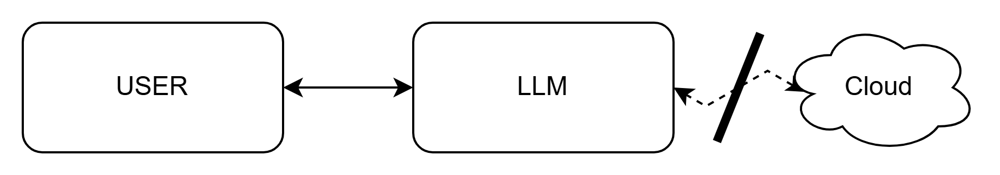
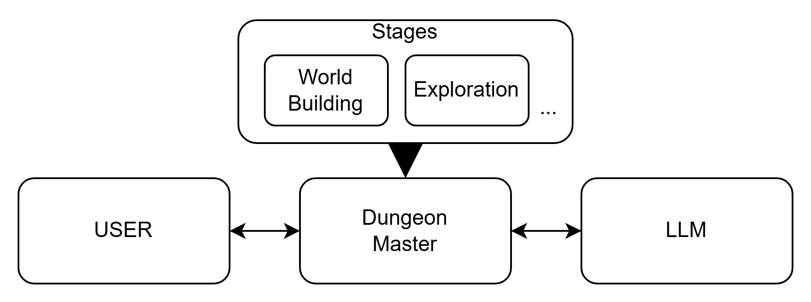

# LLM Dungeon Master for RPG

## Instalation

Install pre-commit hooks:

```
pre-commit install
```

Create uv env

```
uv sync
```

_alternatively If there would be a problem with installation of vosk by uv in macos, please use:_

```
pip install vosk
```

Create .env file which contains:

```
MODELS_PATH=PATH
ASSETS_PATH=PATH
```

For downloading a model from hugginface:

```
huggingface-cli download speakleash/Bielik-4.5B-v3.0-Instruct-GGUF --local-dir models
```

Setup llama-cpp-python with cuda/metal:

```
https://github.com/abetlen/llama-cpp-python
```

For running the app:

```
python src/llm_rpg/interface/app.py
```

## What's inside

Idea was simple - to create offline LLM, that will work as a Dungeon Master - chairman of the RPG session.


But, to fulfill the requirement of offline app, we needed to compromise on model size and capabilities, and what's going with it - small to no model context and memory.
To compensate for that, we created a middle man in between, who will distribute who's turn to talk is, wrap and filter information that goes in both sides

Here:

- User(s) are the players, that choosed to be guided by LLM
- Dungeon Master is the distributor of the information - it chooses who's starting the conversation based on the Stage the players are in.
- Stages are the memory of the Dungeon Master - they are responsible for carring the state of the game. Depending on task it can be information collected by the model in world creation, or specific task given on quest. Either way - they wrap information to be understanded by the model and user, as model has no context - it's needed to provide it each time, as well as precise conditions of the expected answer. In the other way around - model sometimes can talk too much, or repeat itself, so the maximum of value from least amount of text is filtered.
- LLM - preffered model, that takes order and returns answer. In our case it was Bielik, as it was project for course in AGH University.
